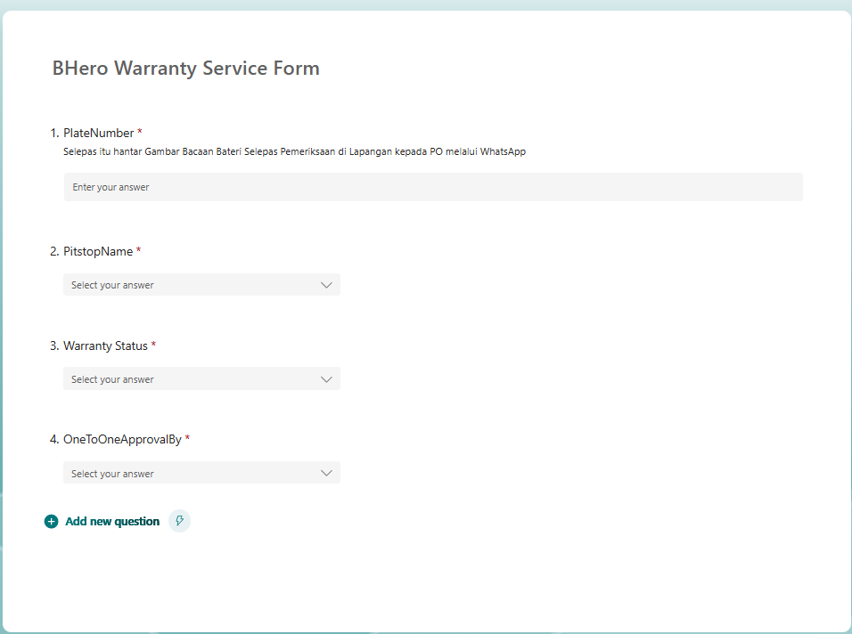
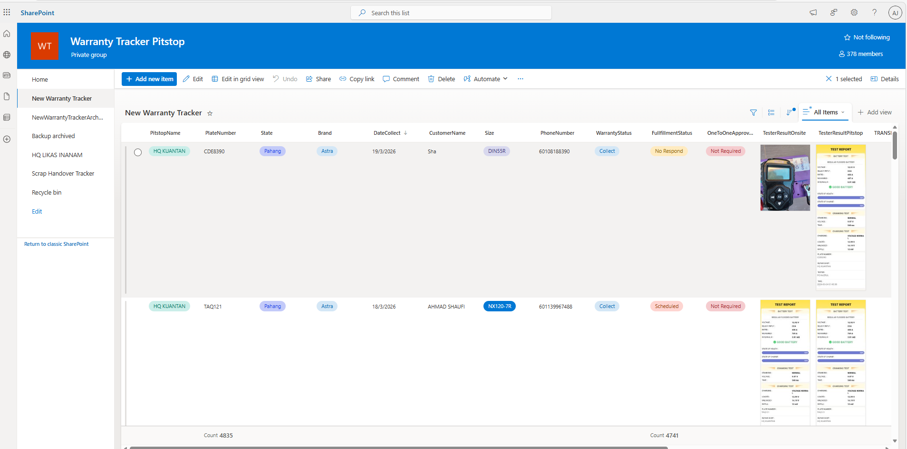
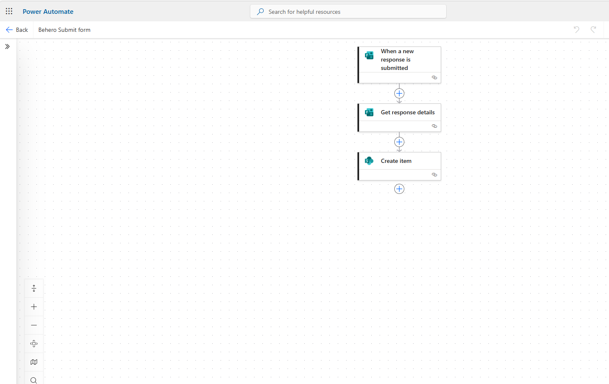

# Warranty Tracker System

## 📌 Overview
A warranty tracking system built using Microsoft Power Platform tools to automate data collection and monitoring.

---

## 🛠 Tools Used
- Microsoft Forms (data input)
- SharePoint (data storage)
- Power Automate (workflow automation)

---

## ⚙️ How It Works
1. User submits warranty details via Microsoft Forms  
2. Data is stored in SharePoint list  
3. Power Automate triggers workflow:
   - Create record
   - Monitor warranty status
   - Send notifications  

---

## 🚀 Features
- Automated data collection  
- Centralized tracking system  
- Warranty expiry monitoring  
- Notification alerts  

---

## 🧑‍💼 My Contribution
- Designed system workflow  
- Built Power Automate flow  
- Structured SharePoint list  
- Integrated Microsoft Forms  

---

## 📸 Screenshots

### 📋 Microsoft Form
User submits warranty details  

---

### 📊 SharePoint List
Central database for warranty tracking  

---

### ⚙️ Power Automate Flow
Handles automation and notifications  

### ⚙️ System flow diagram
New Warranty SOP

---

## 📈 Value
This system reduces manual tracking and improves efficiency using Microsoft ecosystem tools.
